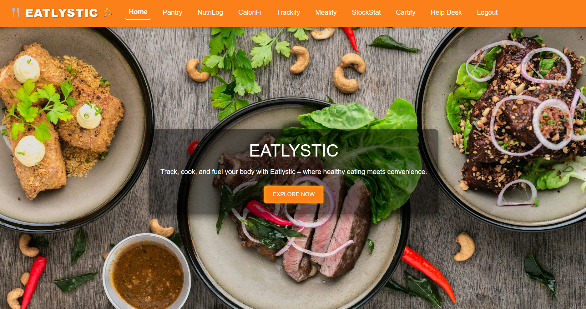
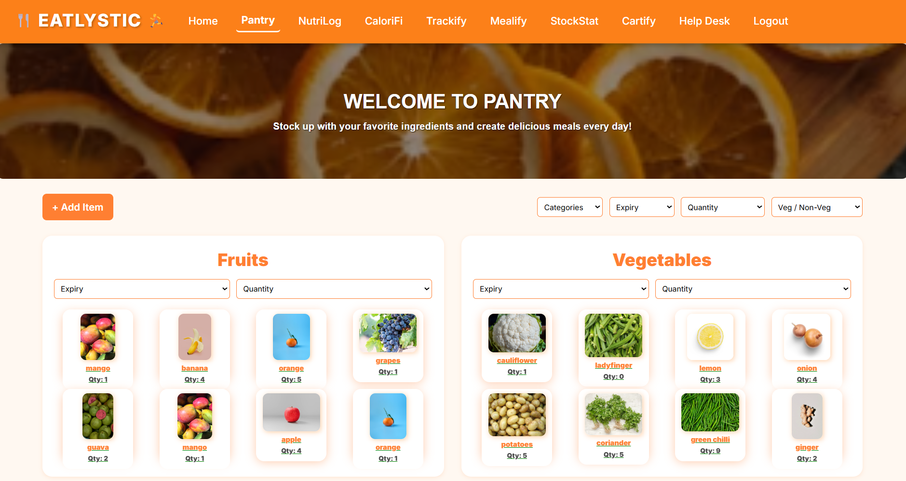
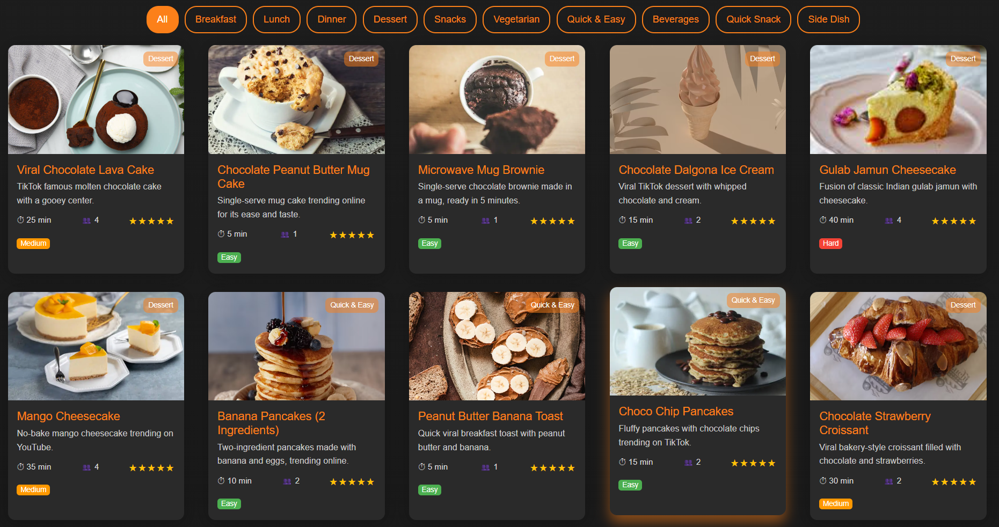
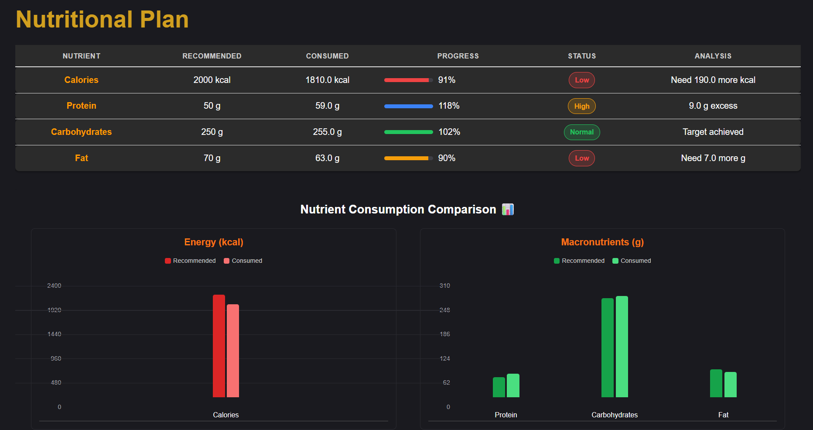

# 🍽️ EatLystic

_EatLystic_ as the name suggests is a combination of two words:

- **🥗 Eat**: representing nutrition, food, and healthy eating habits.  
- **📋 Lystic**: derived from "list" or "logistics," emphasizing organized tracking and management.  

✨ Together, EatLystic means a smart system that helps you eat better by organizing and managing your kitchen and pantry efficiently.

---

## ❓ Why EatLystic?

Managing your kitchen and pantry can be challenging — tracking what you have, when items expire, and how they affect your health goals. EatLystic helps by:

- 🗂️ Keeping an up-to-date inventory of pantry items, quantities, and expiry dates.  
- 🥦 Providing nutritional insights tailored to your dietary needs.  
- 🍳 Offering personalized meal suggestions and health recommendations.  
- ♻️ Helping you waste less food and optimize your nutrition intake.  

With EatLystic, you can **manage what you eat**, **maintain your health goals**, and **ensure your kitchen runs smoothly**.

---

## 🚀 Tech Stack

<p align="center">
     
    
    
</p>

<h3 align="center">⚙️ Backend & Database</h3>
<p align="center">
    
    
    
  
</p>

<h3 align="center">🎨 Styling & UI</h3>
<p align="center">
    
    
  
</p>

<h3 align="center">🛠️ Utility & Vision</h3>
<p align="center">
    
    
    
    
    
  
</p>

---

## ✨ Features

1. **🥡 Pantry**  
   Store ingredients and items in your pantry with expiry dates, quantities, and categories. Edit or delete items anytime.

2. **🔥 Calorify**  
   Track calories in your pantry and consumed ingredients, with real-time calorie checks for any item.

3. **🍎 Nutrilog**  
   View all nutrients in your pantry and consumed items visually. 📸 Scan barcodes via camera to fetch nutritional data instantly.

4. **🏃 Trackify**  
   Answer a questionnaire and get a personalized health profile with **BMI** and step recommendations.

5. **🍲 Melaify**  
   Includes:  
   - 👨‍🍳 **PantryChef**: Recipes from pantry ingredients with details.  
   - 🍴 **MealChef**: Browse recipes to pick favorites.  
   - 📊 **MacrosChef**: Quiz-based nutritional reports and plans, with recipe suggestions.  
   - 📺 **Trending Recipes**: Stay current with popular recipes and videos.  
   - ❤️ **Likes**: Access your liked recipes.  
   - ✍️ **Customize**: Create/edit/save your own recipes.  
   - 🤖 **Eatstik**: AI chatbot for recipe and nutrition assistance.

6. **⏳ Stockify**  
   Tracks expired and expiring pantry items, with notifications and 📄 PDF export for waste reduction.

7. **🛒 Cartify**  
   Suggests shopping list items based on pantry status and recipes.

8. **🆘 Help Desk**  
   FAQs, 📬 contact info, and support to assist users.

---


### 📸 Here's a Glimpse

<p align="center">
    
    
  
  
</p>

---


## 📂 Project Structure

```
EatLystic/
│── .idea/           # Project settings (IDE-specific)
│── Backend/         # Node.js backend server (API, business logic)
│── Frontend/        # React frontend (UI components, pages)
│── package.json     # Dependencies & project metadata
│── .gitignore       # Ignored files for git
│── README.md        # Project documentation
```
---

## ⚙️ Installation & Setup


### 1. Clone the repository
```bash
git clone https://github.com/ShreyaVerma0407/EatLystic.git
cd EatLystic
```
### 2. Install Backend Dependencies
```bash
cd Backend
npm install
```
### 3. Install Frontend Dependencies
```bash
cd Frontend
npm install
```

## 🚀 Running the Project

   * Frontend:

     ```bash
     cd Frontend
     npm run dev
     ```
   * Backend:

     ```bash
     cd Backend
     npm start
     ```

---
## 🛠️ Environment Variables

Make sure to create `.env` files for **both frontend and backend** with the following variables.


### ⚡ Frontend (`frontend/.env`)

```env
# API base URL (backend server)
VITE_API_BASE_URL=http://localhost:3001/api

# Default values for theme, language, etc. (non-secret stuff)
VITE_DEFAULT_THEME=light
VITE_DEFAULT_LANGUAGE=en

# Third-party API keys (replace with your own)
VITE_UNSPLASH_KEY=your_unsplash_key_here
VITE_EDAMAM_APP_ID=your_edamam_app_id_here
VITE_EDAMAM_APP_KEY=your_edamam_app_key_here
VITE_NINJAS_API_KEY=your_ninjas_api_key_here
VITE_USDA_API_KEY=your_usda_api_key_here
VITE_PEXELS_KEY=your_pexels_api_key_here
VITE_SPOON_KEY=your_spoonacular_api_key_here
```
### ⚡ Backend (backend/.env)

```env
# Server ports
PORT_backend=3001
PORT_frontend=3000

# MongoDB connection string (replace with your own)
MONGO_URI=your_mongodb_connection_string_here

# Email credentials (for Nodemailer or similar)
EMAIL_USER=your_email_here
EMAIL_PASS=your_email_password_here

# Third-party API keys (replace with your own)
EDAMAM_APP_ID=your_edamam_app_id_here
EDAMAM_APP_KEY=your_edamam_app_key_here

```
---

## 🤝 Contributing

Contributions are welcome! 🎉
If you’d like to add new features or fix issues, feel free to open a pull request.

---

<p align="center">✨ Made with ❤️ by <b>Team Eatlystic</b></p>


